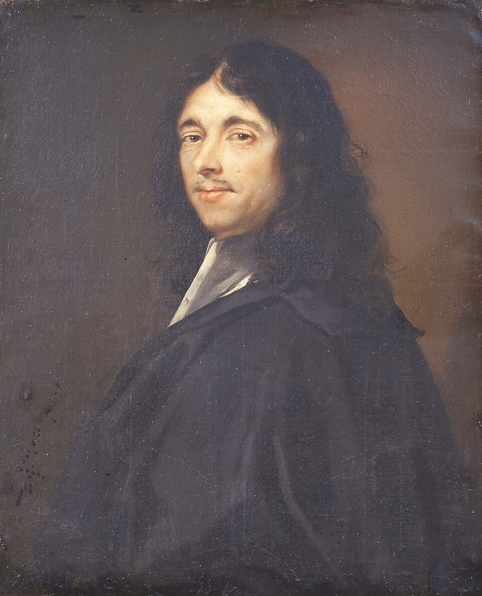

# Le théorème des deux carrés de Fermat

  

Projet de recherche en **théorie des nombres** réalisé au **printemps 2025**.

Ce travail étudie deux résultats classiques de l'arithmétique :

* le **théorème des quatre carrés de Lagrange**
* le **théorème des deux carrés de Fermat**

Le rapport présente les outils mathématiques nécessaires à leur compréhension — congruences, structures algébriques, entiers de Gauss et quaternions — ainsi que différentes approches de démonstration.

📄 Le rapport complet est disponible dans le fichier **`rapport.pdf`**.

---

**Auteurs**

* Julian Cutaya
* Wally Meqqori
* Stefan De Païva

Sous la direction de **Patrick Martinez**.
